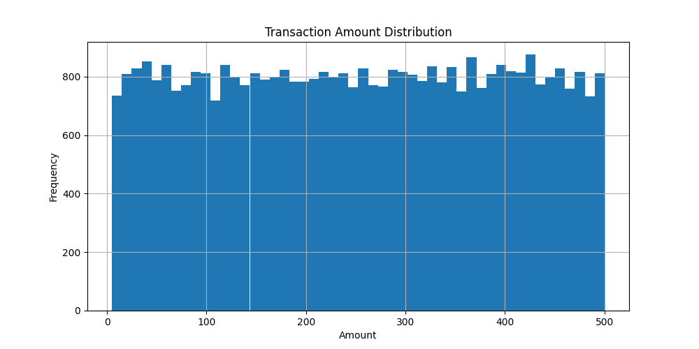
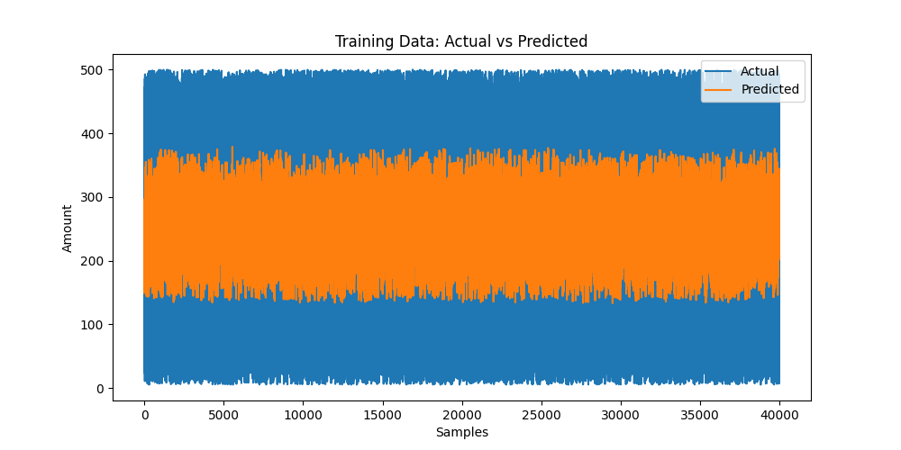
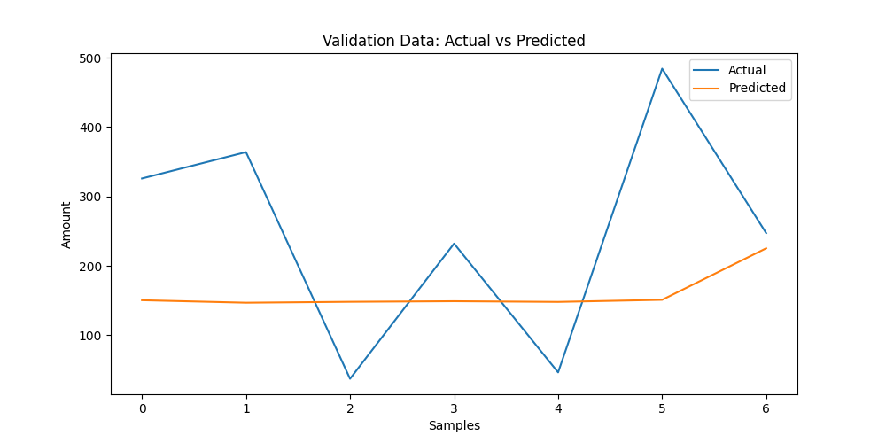
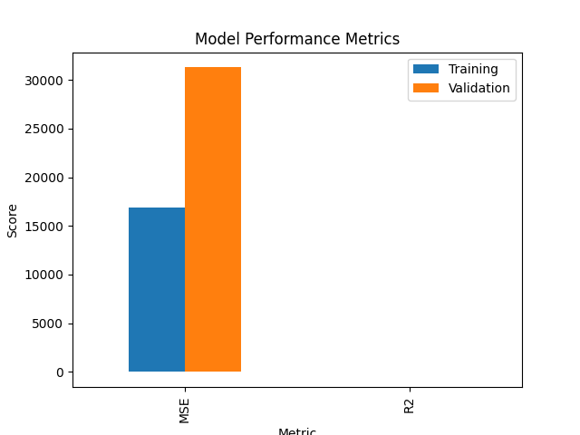
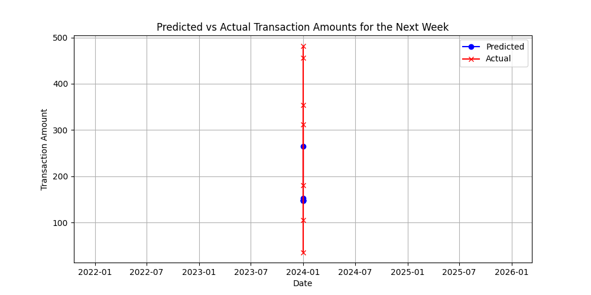

# Credit Card Consumption Prediction

This project involves analyzing and predicting credit card/debit card consumption patterns using machine learning algorithms. The input data is credit card/debit card consumption data, and the output is predicted consumption data for the next week.

## Project Structure

```
project
│   .gitignore
│   main.py
│   README.md
│   requirements.txt
│   setup.py
└───ccp
    ├───data
    │   │   synthetic_consumption_data.csv
    ├───src
    │   │   data_imputation.py
    │   │   data_visualization.py
    │   │   edge_cases.py
    │   │   feature_engineering.py
    │   │   statistical_testing.py
    │   │   train_model.py
    └───test
```

## Workflow

1. **Data Preparation**: The data is split into training, validation, and test sets.
2. **Data Imputation**: Missing values in the data are handled.
3. **Feature Engineering**: Relevant features are created to enhance the model's performance.
4. **Edge Cases Handling**: Any edge cases in the data are addressed.
5. **Statistical Testing**: Statistical tests are performed to understand the data distribution.
6. **Model Training and Validation**: A machine learning model is trained and validated.
7. **Prediction**: Predictions are made for the next week's consumption.
8. **Visualization**: Various plots are generated to visualize the results.

## Figures and Plots

1. **Transaction Amount Distribution**:
   

2. **Training Data: Actual vs Predicted**:
   

3. **Validation Data: Actual vs Predicted**:
   

4. **Model Performance Metrics**:
   

5. **Predicted vs Actual Transaction Amounts for the Next Week**:
   

## Explanation of the Code

### main.py

The main script that orchestrates the entire workflow.

### prepare_data

Splits the data into training, validation, and test sets.

### perform_feature_engineering

Creates new features to improve the model's predictive power.

### handle_missing_values

Fills missing values in the dataset.

### handle_edge_cases

Addresses edge cases such as transactions with negative amounts.

### perform_statistical_tests

Performs statistical tests like the normality test on the data.

### train_and_test_model

Trains a LightGBM model and evaluates it on the validation set.

### predict_next_week

Uses the trained model to predict the next week's consumption.

### visualize_data

Generates and saves histograms of the transaction amounts.

### visualize_next_week_predictions

Generates and saves plots comparing predicted and actual transaction amounts for the next week.

## Running the Project

1. Ensure all dependencies are installed:
   ```
   pip install -r requirements.txt
   ```

2. Run the main script:
   ```
   python main.py
   ```

This will execute the entire workflow, generating the predictions and plots mentioned above.
